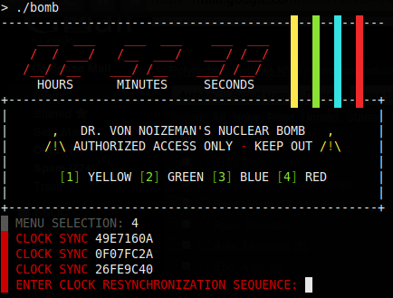

# Reverse Engineering Bomb Assignment for CSCI 4971

**Author:** Ryan Govostes  
**Date:** March 14, 2010

In the Spring 2010 semester, RPISEC members hosted the course [CSCI 4971 - Secure Software Principles][4971]. One of the lab assignments was to reverse engineer and defuse a "binary bomb", strongly inspired by Dave Hollinger's [CompOrg Binary Bomb Squad][dave] assignment.

  

In the original lab, each student received a personalized binary. But for 13 years, only a single unexploded binary survived to make its way around the 'net, showing up in other courses such as Texas A&M's CSCE 451 – Software Reverse Engineering.

This repository now hosts the original sources for historical interest. The original code compiles for 32-bit x86, or the `modern` branch contains a slightly modified version that compiles on other architectures.

**Note:** Compile and run the program once. Note the `CHECKSUM` value that is printed out. Update the constant in `bomb.c:143` and recompile.

  [4971]: http://www.cs.rpi.edu/academics/courses/spring10/csci4971/
  [dave]: https://web.archive.org/web/20100610022306/http://cgi2.cs.rpi.edu/~hollingd/comporg/hw/hw3/hw3.html
